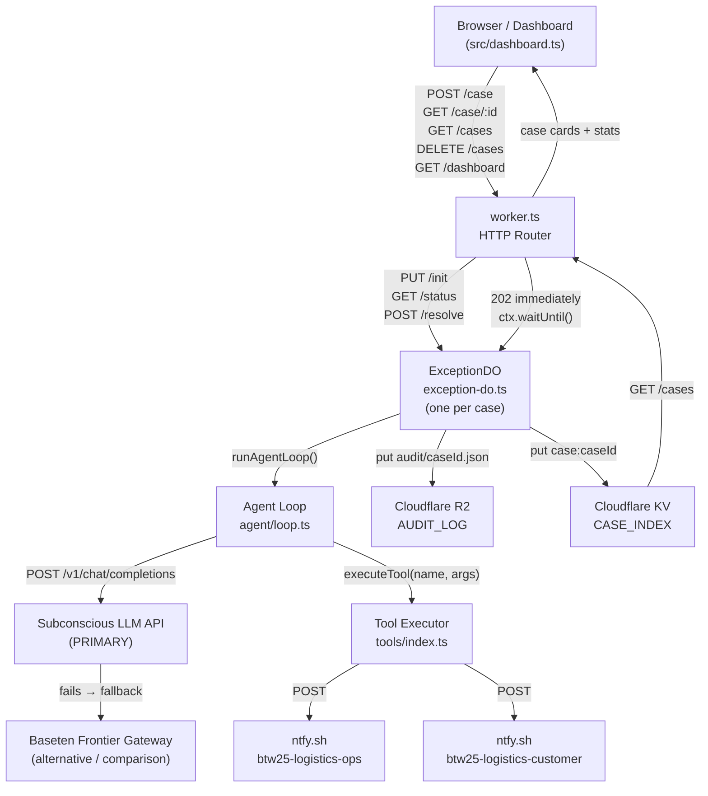
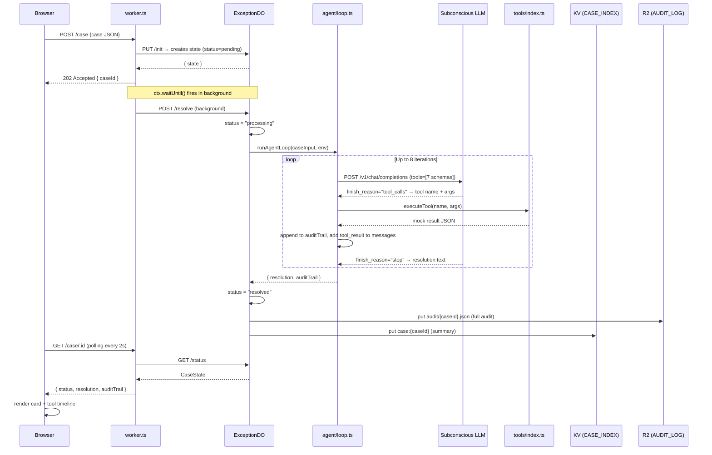
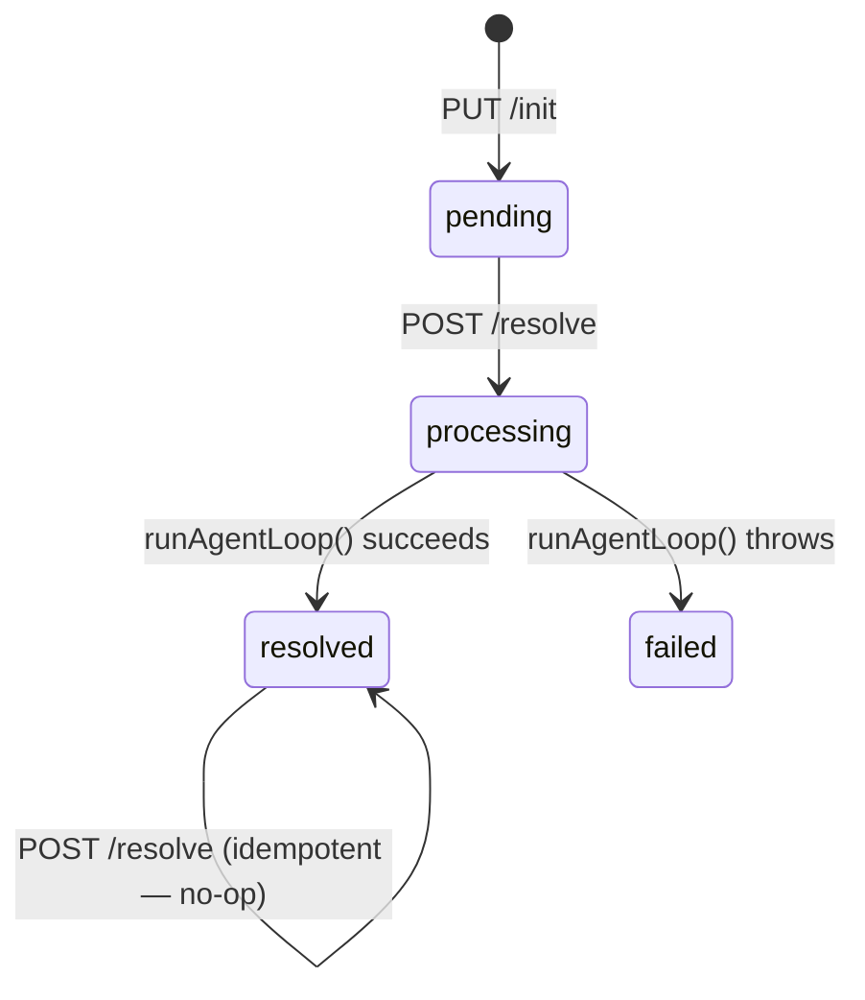
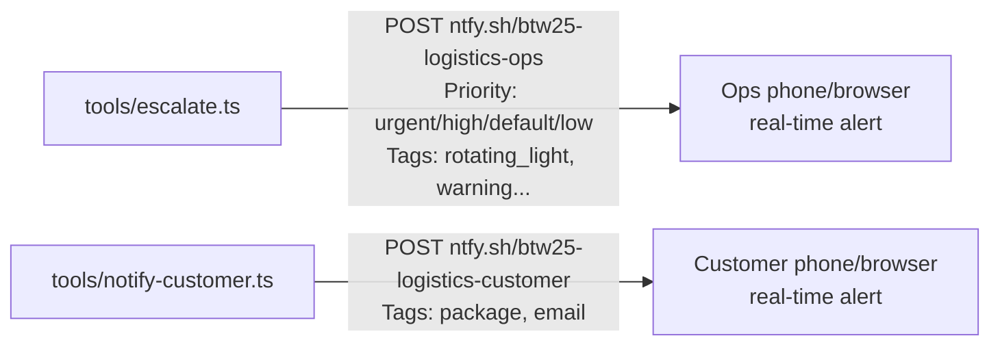

# Day 7 — Logistics Exception Agent: Architecture

Built on **Cloudflare Workers + Durable Objects**. Each shipment exception case gets its own isolated Durable Object that holds all state, runs the LLM reasoning loop, writes an audit trail to R2, and publishes a summary to KV.

---

## System Overview



---

## Request Lifecycle (step by step)



---

## File Map

```
day7/
├── src/
│   ├── worker.ts           ← HTTP router — entry point for all requests
│   ├── exception-do.ts     ← ExceptionDO class — one instance per case
│   ├── dashboard.ts        ← Returns full HTML for GET /dashboard
│   ├── agent/
│   │   ├── loop.ts         ← LLM reasoning loop (fetch-based, no SDK)
│   │   └── tools.ts        ← 7 OpenAI-format tool schemas (sent to LLM)
│   └── tools/
│       ├── index.ts        ← executeTool() dispatcher
│       ├── contact-carrier.ts   → mock: returns carrier inquiry result
│       ├── escalate.ts          → REAL: fires ntfy.sh/btw25-logistics-ops
│       ├── file-claim.ts        → mock: returns claim ID
│       ├── notify-customer.ts   → REAL: fires ntfy.sh/btw25-logistics-customer
│       ├── refund.ts            → mock: returns refund ID
│       ├── reschedule.ts        → mock: returns new tracking number
│       └── void-label.ts        → mock: returns void confirmation
├── eval/
│   ├── cases.json          ← 8 test exception cases
│   └── run.js              ← Node script to POST all 8 cases at once
└── wrangler.jsonc          ← Cloudflare config (DO, KV, R2 bindings)
```

---

## Component Responsibilities

| File | What it owns |
|------|-------------|
| `worker.ts` | HTTP routing, stub creation, `ctx.waitUntil()` for async resolve |
| `exception-do.ts` | Per-case state machine (`pending → processing → resolved/failed`), R2 write, KV write |
| `agent/loop.ts` | LLM conversation loop, Subconscious → Baseten Frontier Gateway fallback, auditTrail accumulation |
| `agent/tools.ts` | OpenAI function-calling schemas — tells the LLM what tools exist |
| `tools/index.ts` | `executeTool()` switch — dispatches string tool names to typed implementations |
| `tools/escalate.ts` | Generates ticket ID, POSTs to ntfy.sh with priority/tag mapping |
| `tools/notify-customer.ts` | POSTs customer notification to ntfy.sh |
| `tools/*.ts` (others) | Deterministic mock responses (same args → same result) |
| `dashboard.ts` | Self-contained HTML/CSS/JS — polls `/case/:id` every 2s, renders cards |

---

## Exception Types → Tool Sequences

| Exception | Tools Called |
|-----------|-------------|
| `delayed_shipment` | `contact_carrier` → `notify_customer` |
| `address_not_found` | `notify_customer` → `escalate` (if >1 attempt) |
| `delivery_dispute` | `file_claim` → `escalate` |
| `customs_hold` | `escalate` (customs broker) → `notify_customer` |
| `damaged_package` | `file_claim` → `refund` or `reschedule` |
| `carrier_api_failure` | `escalate` (ops, critical) — no customer notification |
| `return_not_received` | `contact_carrier` → `escalate` |
| `duplicate_shipment` | `void_label` → confirms primary shipment |

---

## State Machine (per Durable Object)



---

## Cloudflare Bindings

| Binding | Type | Purpose |
|---------|------|---------|
| `EXCEPTION_DO` | Durable Object | One DO instance per `caseId` — holds SQLite state |
| `CASE_INDEX` | KV Namespace | Stores resolved case summaries, queried by `GET /cases` |
| `AUDIT_LOG` | R2 Bucket | Stores full audit JSON at `audit/{caseId}.json` |
| `SUBCONSCIOUS_API_KEY` | Secret | **Primary** LLM provider (per sponsor stack) |
| `SUBCONSCIOUS_BASE_URL` | Env var | Subconscious API endpoint |
| `BASETEN_GATEWAY_URL` | Env var | Baseten **Frontier Gateway** endpoint |
| `BASETEN_API_KEY` | Secret | Fallback LLM provider via Frontier Gateway |
| `BASETEN_MODEL` | Env var | Model routed through Frontier Gateway (e.g. `deepseek-ai/DeepSeek-V3.1`) |

---

## Real External Integrations



Both integrations fire real HTTP requests to `ntfy.sh` — no signup required, works in any browser or the ntfy mobile app.
